# AegisCloud — Cloud-Native DevSecOps & GitOps Laboratory

> A local, cost-free DevSecOps laboratory running a complete delivery chain: source control, CI with quality and security gates, container registry, Kubernetes deployment, GitOps synchronization and observability.

[](https://www.docker.com/)
[](https://k3s.io/)
[](https://www.jenkins.io/)
[](https://argo-cd.readthedocs.io/)
[](https://www.terraform.io/)
[](https://www.ansible.com/)
[](https://prometheus.io/)
[](https://grafana.com/)
[](https://trivy.dev/)
[](LICENSE)

---

## Attribution

**AegisCloud is built on top of [CloudDevOpsProject](https://github.com/Waleeddarwesh/CloudDevOpsProject) by Waleed Darwesh (MIT License).**
The application code (originally from [`Ibrahim-Adel15/iVolveFinalProject`](https://github.com/Ibrahim-Adel15/iVolveFinalProject)), the Terraform modules, the Ansible roles, the Kubernetes manifests, the Jenkins shared library and the monitoring configuration come from that project. The original copyright notice is preserved in [`LICENSE`](LICENSE).

**My contribution** is making this platform run end to end on a local, free environment (no paid AWS resources), fixing what broke on the way, validating the whole chain, and documenting it. Everything I changed is listed in [What I adapted](#what-i-adapted).

---

## Table of Contents

* [Overview](#overview)
* [Key Results](#key-results)
* [Architecture](#architecture)
* [Delivery Workflow](#delivery-workflow)
* [Technology Stack](#technology-stack)
* [What I adapted](#what-i-adapted)
* [Evidence](#evidence)
* [Security](#security)
* [Project Structure](#project-structure)
* [Quick Start](#quick-start)
* [Troubleshooting](#troubleshooting)
* [Limitations and Next Steps](#limitations-and-next-steps)
* [Author](#author)
* [License](#license)

---

## Overview

AegisCloud reproduces a modern software delivery lifecycle on a single Debian VM:

* **Jenkins** builds, tests and scans three microservices (`auth-service`, `frontend`, `roadmap-service`).
* **SonarQube** enforces a quality gate; **Trivy** blocks any image that has a fixable CRITICAL vulnerability.
* Images are published to a **local registry** (`localhost:5001`).
* Jenkins commits the new image tag to Git; **ArgoCD** reconciles the **k3s** cluster to that state.
* **Prometheus, Grafana and Alertmanager** observe the result.

The goal is not to install tools side by side, but to make them work together as one delivery platform.

---

## Key Results

| Area | Validated result |
| --- | --- |
| CI | 3 Jenkins pipelines green end to end (9 stages each) |
| Code quality | SonarQube quality gate passed on the 3 projects |
| Image security | Trivy gate enforced; real findings fixed (see [Security](#security)) |
| Registry | 3 images published to `localhost:5001` |
| Kubernetes | k3s cluster running the 3 services and MySQL |
| GitOps | ArgoCD in auto-sync, `Synced` and `Healthy` (48 resources) |
| Monitoring | 16 / 16 Prometheus targets up; Grafana and Alertmanager reachable |
| Terraform | Validated locally (`init -backend=false`, `validate`); **not deployed** |
| Ansible | Playbook completes with `failed=0` |
| Cost | No paid cloud resource used |

---

## Architecture

The full description, with component tables, is in **[docs/architecture/README.md](docs/architecture/README.md)**.

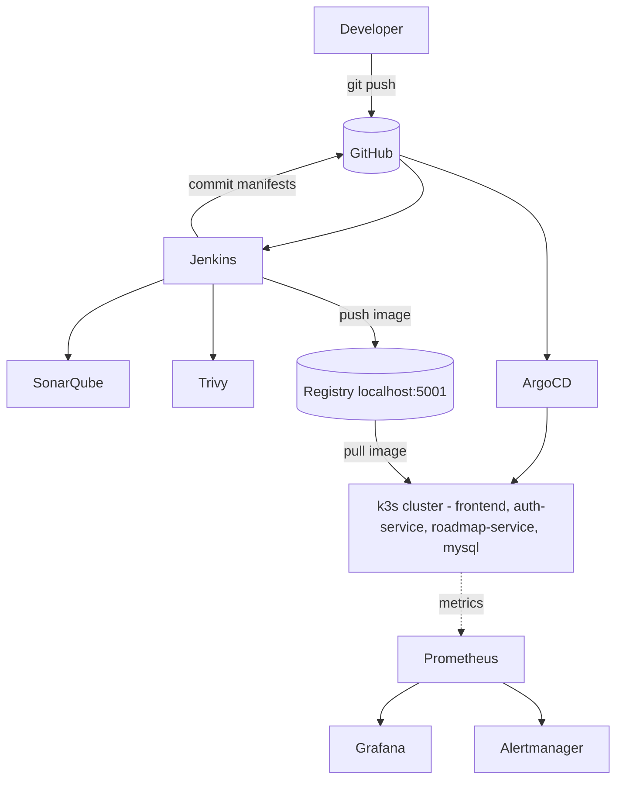

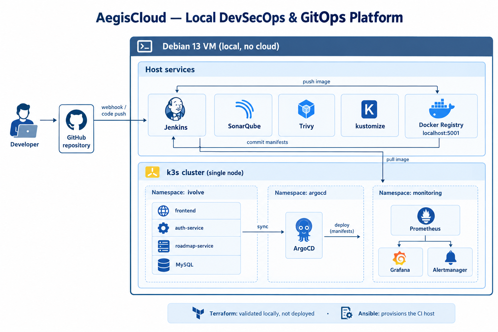

> Gitleaks, Hadolint and Checkov shown in this illustration belong to the workflow inherited from the original project (`.github/workflows/ci.yml`), not to the local Jenkins pipeline described below.

---

## Delivery Workflow

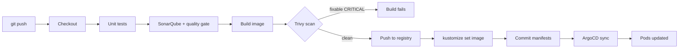

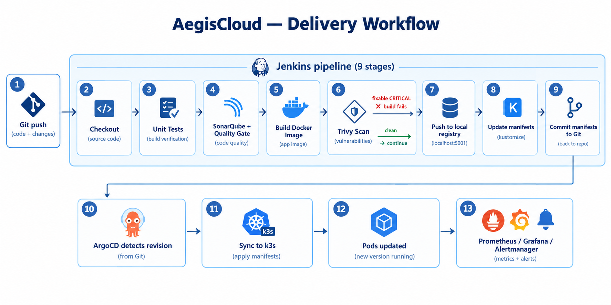

---

## Technology Stack

| Layer | Technology | Role |
| --- | --- | --- |
| Source control | Git, GitHub | Code and desired state |
| CI | Jenkins (Groovy shared library) | Pipeline orchestration |
| Code quality | SonarQube | Static analysis, quality gate |
| Image security | Trivy | Vulnerability scan, blocking gate |
| Containers | Docker, Registry v2 | Packaging and local image storage |
| Orchestration | k3s, Kustomize | Local Kubernetes and configuration overlays |
| GitOps | ArgoCD | Desired-state reconciliation |
| IaC | Terraform | Original AWS infrastructure, validated locally |
| Automation | Ansible | Provisioning of the Jenkins host |
| Observability | Prometheus, Grafana, Alertmanager | Metrics, dashboards, alerts |

---

## What I adapted

| Topic | Original project | AegisCloud |
| --- | --- | --- |
| Cluster | EKS | k3s, `local-path` storage (overlay in `aegiscloud-local/k8s`) |
| Registry | ECR | Local registry `localhost:5001` (`ecrPush` step adapted in my shared library) |
| Pipelines | Original repository | Jenkinsfiles pointed to this repository, write-enabled GitHub credential for manifest commits |
| Jenkins proxy | Pointed to a private AWS IP | Pointed to the k3s node (overlay patch) |
| Host tooling | EC2 instance | Debian 13 VM; `kustomize` installed; Ansible fixes for SonarQube on Debian 13 |
| Findings | n/a | Vulnerable dependencies upgraded after Trivy reported them |
| ArgoCD | n/a | `ignoreDifferences` rule for the MySQL StatefulSet so the application reports `Synced` |

Source files from the original project were not rewritten: changes are kept in the overlay or in small, targeted commits.

---

## Evidence

### Docker registry

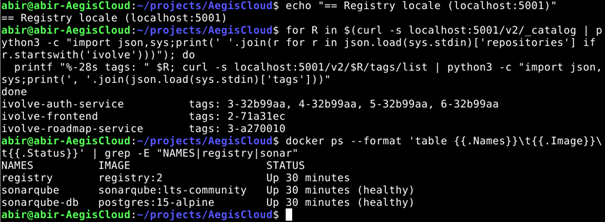

### Terraform validation

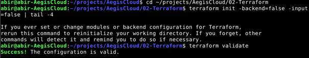

### Ansible

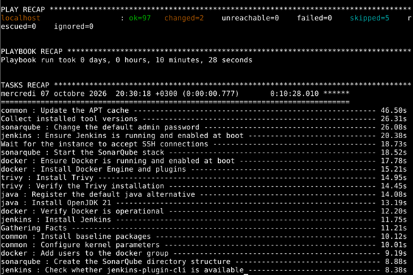

### Kubernetes workloads and application

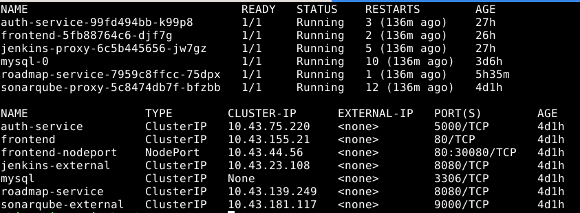

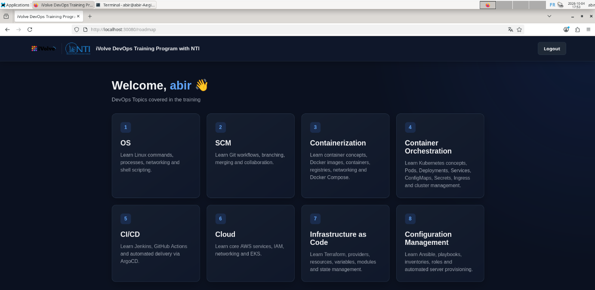

### Jenkins

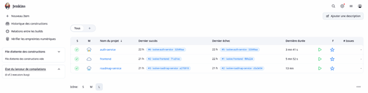

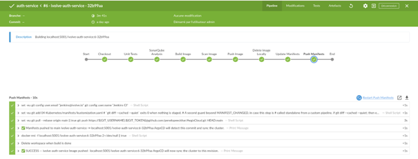

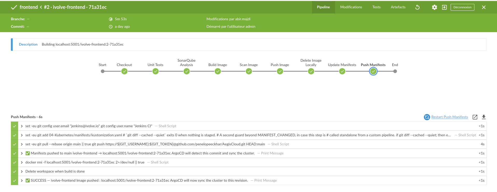

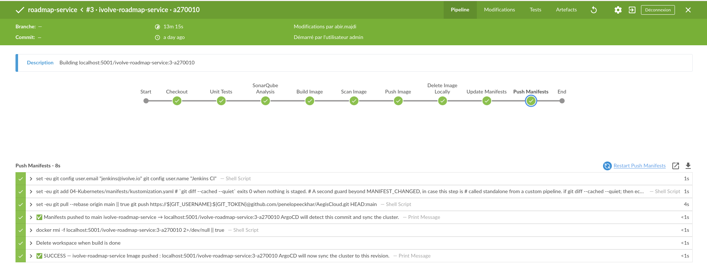

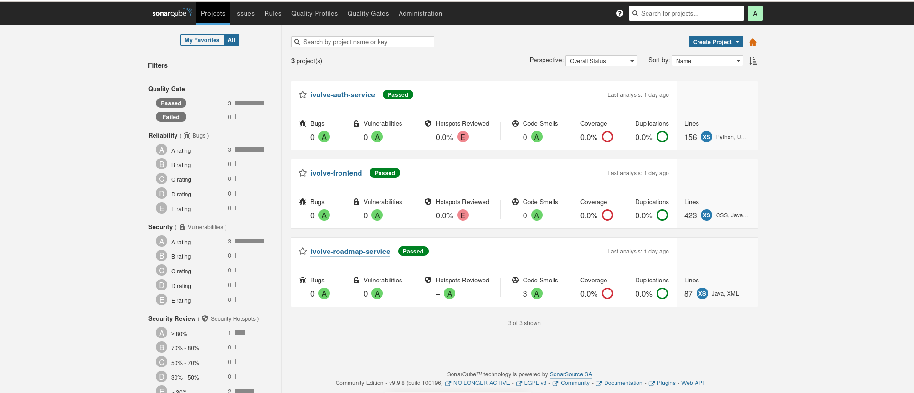

### ArgoCD

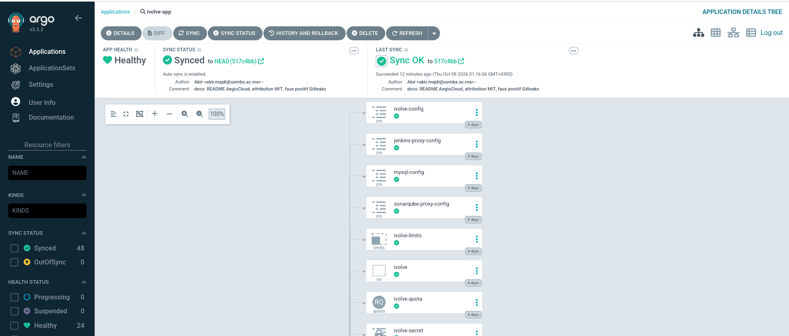

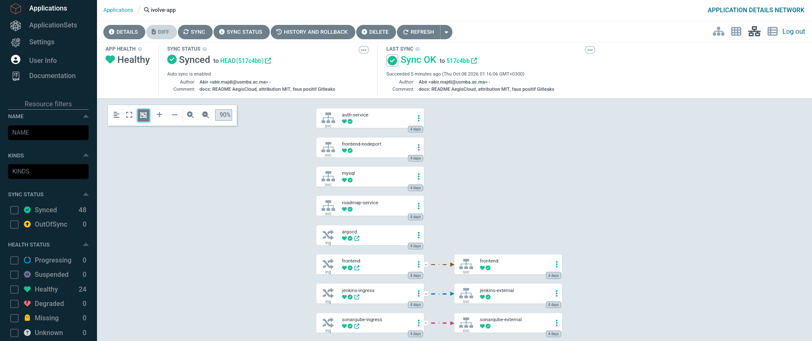

### Monitoring

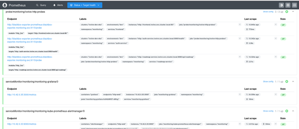

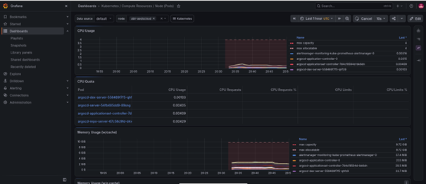

### End to end

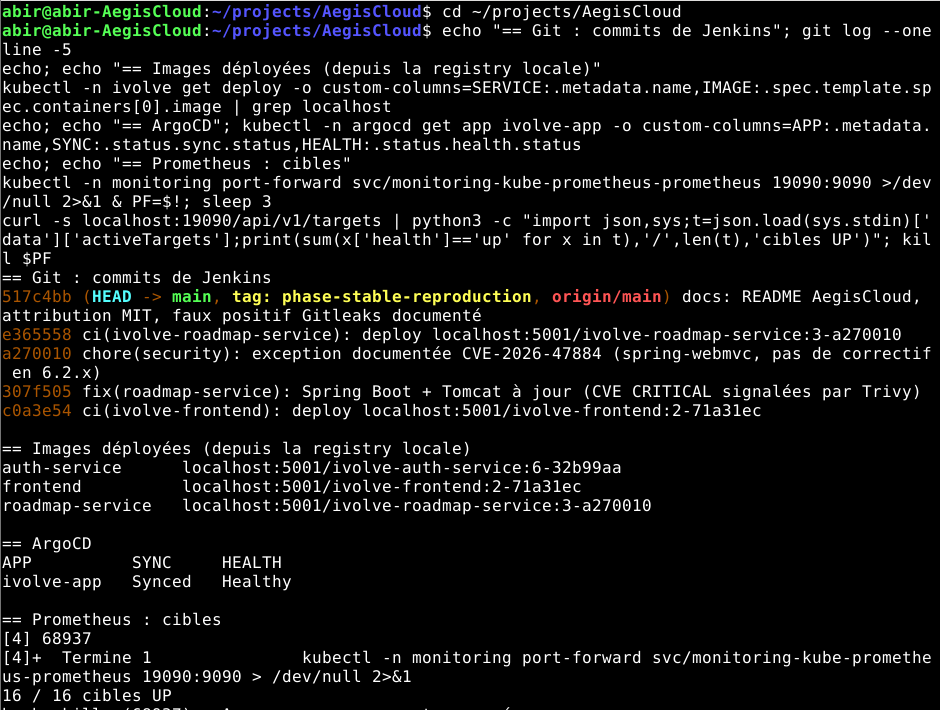

---

## Security

### Controls running in the local Jenkins pipeline

| Control | Behaviour |
| --- | --- |
| SonarQube quality gate | Pipeline waits for the gate; the 3 projects pass |
| Trivy image scan | Reports HIGH/CRITICAL, then **fails the build on any CRITICAL with an available fix** |

### Findings handled during the project

| Finding | Action |
| --- | --- |
| `proxy-addr` (frontend), CVE-2026-90711, CRITICAL | Upgraded to 2.0.8 in `package-lock.json` |
| Tomcat embedded (roadmap-service), 3 CRITICAL CVEs | Upgraded through the Spring Boot parent and `tomcat.version` |
| `spring-webmvc`, CVE-2026-47884, CRITICAL | **Documented exception** in [`.trivyignore`](.trivyignore): the fix exists only in Spring Framework 7 (Spring Boot 4), the service does not use XSLT, and the exception expires on 2027-01-31 |
| Gitleaks, 1 result in an upstream documentation example | **False positive** (`CHANGE_ME` in base64), documented in [`.gitleaksignore`](.gitleaksignore) |

A security exception is explicit, justified and time-limited rather than silently ignored.

### Not part of the local pipeline

Gitleaks, Hadolint and Checkov are referenced by the GitHub Actions workflow inherited from the original project (`.github/workflows/ci.yml`). They are **not** executed by the local Jenkins pipeline. Gitleaks was run manually on the full repository history.

---

## Project Structure

```text
AegisCloud/
├── 01-Docker/            Docker Compose stack (local)
├── 02-Terraform/         Original AWS infrastructure as code (validated, not deployed)
├── 03-Ansible/           Provisioning of the Jenkins host
├── 04-Kubernetes/        Base Kubernetes manifests (Kustomize)
├── 05-Jenkins/           Jenkinsfiles and Groovy shared library
├── 06-ArgoCD/            AppProject and Application
├── 07-Monitoring/        Prometheus / Grafana / Alertmanager configuration
├── aegiscloud-local/     Local overlay (k3s storage, local images, proxy patch)
├── docs/
│   ├── architecture/     Architecture documentation
│   └── screenshots/      Validation evidence
├── scripts/              Utility scripts
├── src/                  Application source (3 microservices)
├── .github/workflows/    Workflow inherited from the original project
├── .gitleaksignore
├── .trivyignore
├── LICENSE
├── Makefile
└── README.md
```

---

## Quick Start

Prerequisites: a Debian host with Docker, Git, `kubectl`, Terraform and Ansible.

```bash
git clone https://github.com/penelopeeckhar/AegisCloud.git
cd AegisCloud
```

| Step | Command or location |
| --- | --- |
| Terraform check (no AWS needed) | `cd 02-Terraform && terraform init -backend=false && terraform validate` |
| Provision the CI host | `cd 03-Ansible && ansible-playbook -i <inventory> playbook.yml -K --skip-tags aws,kubectl,helm` |
| Cluster | k3s; the application is deployed by ArgoCD from `aegiscloud-local/k8s` |
| Pipelines | Jenkins jobs use `05-Jenkins/Jenkinsfiles/<service>.Jenkinsfile` |
| Registry | `registry:2` published on `localhost:5001` |

The Jenkins host needs `kustomize` on its `PATH`, and a GitHub credential (`github-token`) with **Contents: Read and write** on this repository.

---

## Troubleshooting

Problems met while building this lab, with their fixes:

| Symptom | Cause | Fix |
| --- | --- | --- |
| `kustomize: not found` in Update Manifests (exit 127) | Binary not installed on the Jenkins host | Install `kustomize` in `/usr/local/bin` |
| `403` / `Write access to repository not granted` on Push Manifests | Token with read-only Contents permission | Grant **Contents: Read and write** |
| `SECURITY GATE FAILED` | Fixable CRITICAL vulnerability | Upgrade the dependency, or document a justified exception |
| Trivy `FATAL ... timeout` on a Java image | First run downloads the 900 MB Java database | Re-run once the cache is populated |
| `jenkins-proxy` in a restart loop | Proxy pointed to the original private AWS IP | Overlay patch to the k3s node, then recreate the pod |
| ArgoCD `OutOfSync` on the MySQL StatefulSet | Cluster adds `apiVersion` / `kind` to `volumeClaimTemplates` | `ignoreDifferences` rule on those two fields |
| `apt update` fails on the Kubernetes repository (Debian 13) | Key rejected by the new signature policy | Not needed here: `kubectl` comes with k3s |

---

## Limitations and Next Steps

* Single-node local cluster; Jenkins and SonarQube run on the host, not in the cluster.
* Terraform is validated but never applied.
* Gitleaks, Hadolint and Checkov are not yet integrated into the Jenkins pipeline.
* Secrets management, RBAC and NetworkPolicies are inherited as-is and not yet hardened.

Planned security work, tracked as separate commits so that it stays distinguishable from the reproduced baseline (tag `phase-stable-reproduction`):

* Kubernetes: RBAC least privilege, NetworkPolicies, pod hardening
* Secrets: improved management, no plaintext configuration
* Supply chain: SBOM, image signing and verification
* CI/CD: Gitleaks, Hadolint and Checkov as pipeline stages, policy as code
* Runtime security

---

## Author

**Abir Majdi** — Engineering student, Digital Development & Cybersecurity, ENSA Fès (Morocco).
Interests: DevSecOps, Cloud Security, Kubernetes Security, Detection Engineering.

[GitHub — AegisCloud](https://github.com/penelopeeckhar/AegisCloud)

---

## License

Distributed under the MIT License. The original copyright notice (Waleed Darwesh) is preserved, with additional copyright for the modifications made in AegisCloud. See [`LICENSE`](LICENSE).
