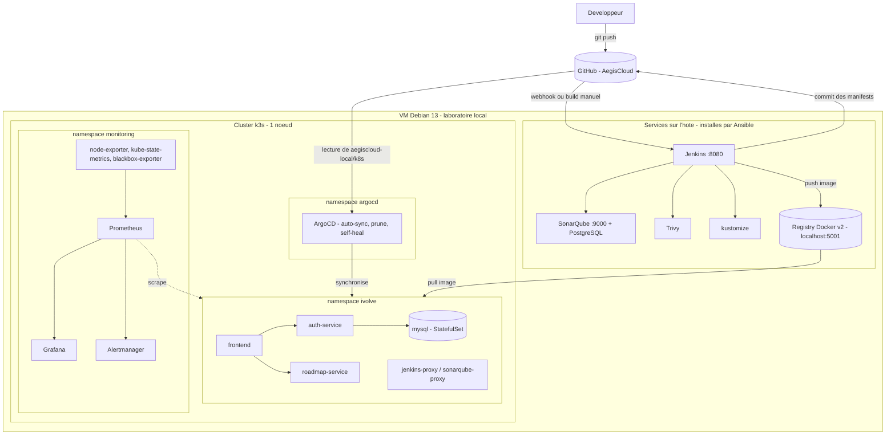

# AegisCloud — Architecture

Ce document décrit **ce qui tourne réellement** dans le laboratoire AegisCloud. Les schémas sont en Mermaid (rendus directement par GitHub) afin de rester fidèles au code et faciles à mettre à jour.

Deux vues :

1. [Architecture de la plateforme](#1-architecture-de-la-plateforme) : où tourne chaque composant.
2. [Workflow de livraison](#2-workflow-de-livraison-de-bout-en-bout) : ce qui se passe entre un `git push` et un pod en production locale.

---

## 1. Architecture de la plateforme

Tout s'exécute sur **une seule VM Debian 13** (disque externe). Aucun service AWS payant n'est utilisé.



### Composants

| Couche | Composant | Rôle | Où ça tourne |
|---|---|---|---|
| Source | GitHub (`AegisCloud`) | Source de vérité du code et de l'état désiré | Externe |
| CI | Jenkins | Orchestre le pipeline | Hôte (systemd) |
| Qualité | SonarQube | Analyse statique + quality gate | Hôte (Docker) |
| Sécurité image | Trivy | Scan des vulnérabilités de l'image | Hôte |
| Registry | `registry:2` | Stocke les images (`localhost:5001`) | Hôte (Docker) |
| Orchestration | k3s | Kubernetes local mono-nœud | Hôte |
| GitOps | ArgoCD | Réconcilie le cluster avec Git | Cluster |
| Application | frontend, auth-service, roadmap-service, mysql | Application de démonstration (3 microservices + base) | Cluster, namespace `ivolve` |
| Observabilité | Prometheus, Grafana, Alertmanager + exporters | Métriques, dashboards, alertes | Cluster, namespace `monitoring` |
| IaC | Terraform | Définition de l'infrastructure AWS d'origine, **validée localement uniquement** (`init -backend=false`, `validate`) | Non déployé |
| Automatisation | Ansible | Installe et configure l'hôte Jenkins (Java, Docker, Jenkins, Trivy, SonarQube) | Hôte |

### Adaptations locales par rapport au projet d'origine

| Sujet | Projet d'origine | AegisCloud |
|---|---|---|
| Kubernetes | EKS | k3s |
| Stockage | EBS (CSI) | `local-path` (patch dans `aegiscloud-local/k8s`) |
| Registry | ECR | Registry locale `localhost:5001` |
| Proxy Jenkins | Redirigé vers l'IP privée du serveur AWS | Redirigé vers le nœud k3s |
| Outils CI | Installés sur l'instance EC2 | Installés sur la VM (rôles Ansible, `--skip-tags aws,kubectl,helm`) |

---

## 2. Workflow de livraison de bout en bout

Pipeline Jenkins en **9 étapes**, suivi de la réconciliation GitOps.

```mermaid
flowchart LR
    A["git push"] --> B["1. Checkout"]
    B --> C["2. Unit tests"]
    C --> D["3. SonarQube + quality gate"]
    D --> E["4. Build image"]
    E --> F{"5. Scan Trivy"}
    F -->|CRITICAL corrigeable| X["Build en echec - image non publiee"]
    F -->|aucune| G["6. Push vers localhost:5001"]
    G --> H["7. Suppression de l'image locale"]
    H --> I["8. kustomize edit set image"]
    I --> J["9. Commit des manifests sur main"]
    J --> K["ArgoCD detecte la nouvelle revision"]
    K --> L["Synchronisation de k3s"]
    L --> M["Pods mis a jour"]
    M --> N["Prometheus collecte les metriques"]
    N --> O["Grafana / Alertmanager"]
```



### Étapes du pipeline

| # | Étape Jenkins | Ce qu'elle fait | Condition d'échec |
|---|---|---|---|
| 1 | Checkout | Récupère le dépôt, calcule le tag `<n° de build>-<sha court>` | Dépôt inaccessible |
| 2 | Unit Tests | Tests dans un conteneur par langage (Python, Node, Java) | Test en échec |
| 3 | SonarQube Analysis | Analyse + attend le quality gate | Quality gate non passé |
| 4 | Build Image | Build Docker multi-étapes | Erreur de build |
| 5 | Scan Image | Trivy : rapport HIGH/CRITICAL, puis contrôle bloquant sur les CRITICAL **corrigeables** | CRITICAL avec correctif disponible |
| 6 | Push Image | Publie dans `localhost:5001` | Registry inaccessible |
| 7 | Delete Image Locally | Libère le disque | — |
| 8 | Update Manifests | `kustomize edit set image` dans `04-Kubernetes/manifests/kustomization.yaml` | `kustomize` absent |
| 9 | Push Manifests | Commit `[skip ci]` sur `main` avec le jeton GitHub | Droit d'écriture manquant |

### Sécurité : ce qui s'exécute et où

| Contrôle | Où | Remarque |
|---|---|---|
| Quality gate SonarQube | **Pipeline Jenkins local** | Les 3 projets sont en `Passed` |
| Scan d'image Trivy (bloquant) | **Pipeline Jenkins local** | A bloqué `frontend` (`proxy-addr`) et `roadmap-service` (Tomcat, Spring) jusqu'à correction |
| Exception documentée | `.trivyignore` | `CVE-2026-47884` (spring-webmvc) : correctif uniquement dans Spring Framework 7 ; l'application n'utilise pas XSLT ; expiration le 2027-01-31 |
| Gitleaks | Exécuté **manuellement** sur l'historique complet | 1 résultat, faux positif documenté dans `.gitleaksignore` |
| Hadolint, Checkov, Gitleaks (workflow d'origine) | `.github/workflows/ci.yml` hérité du projet d'origine | **Hors pipeline Jenkins local** |

### Boucle GitOps

```text
Jenkins commit les manifests  ->  GitHub (main)
GitHub  ->  ArgoCD (lecture de aegiscloud-local/k8s, kustomize)
ArgoCD  ->  k3s  (auto-sync + prune + self-heal)
```

L'overlay `aegiscloud-local/k8s` hérite de `04-Kubernetes/manifests` : le tag d'image écrit par Jenkins est donc repris tel quel par ArgoCD, sans second fichier à maintenir.

